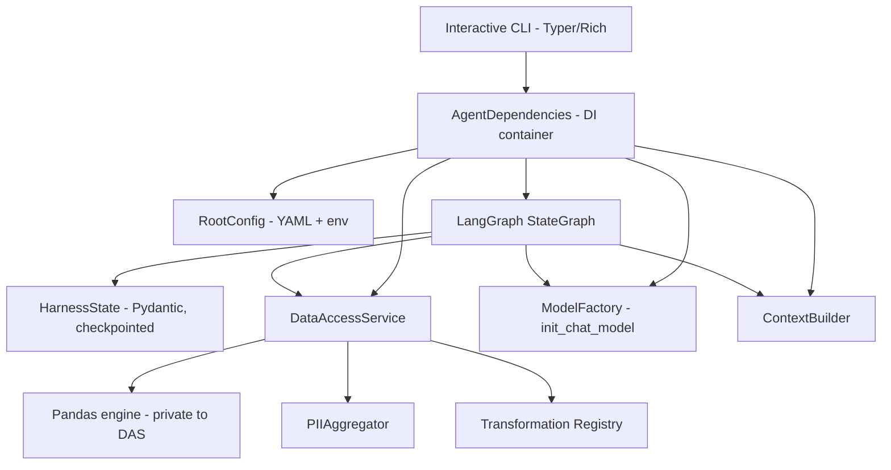
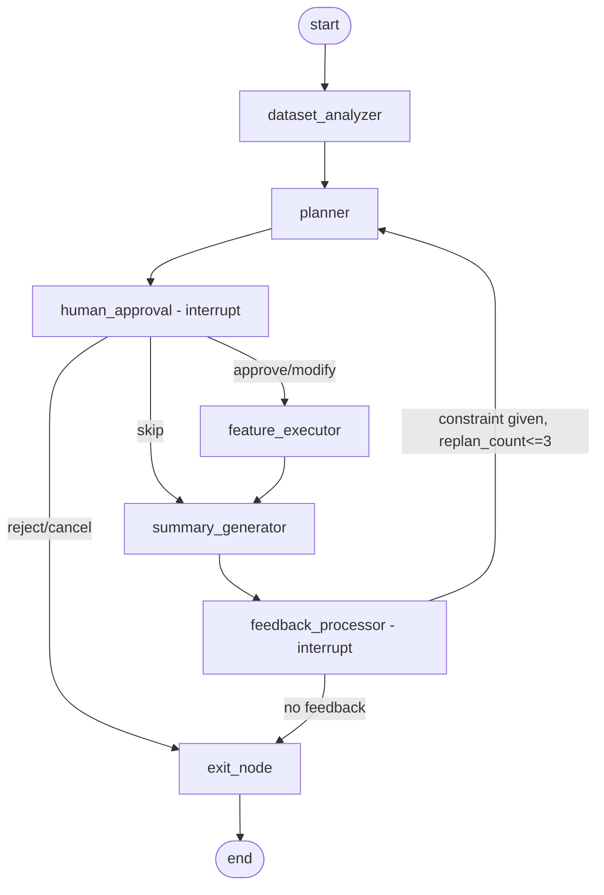
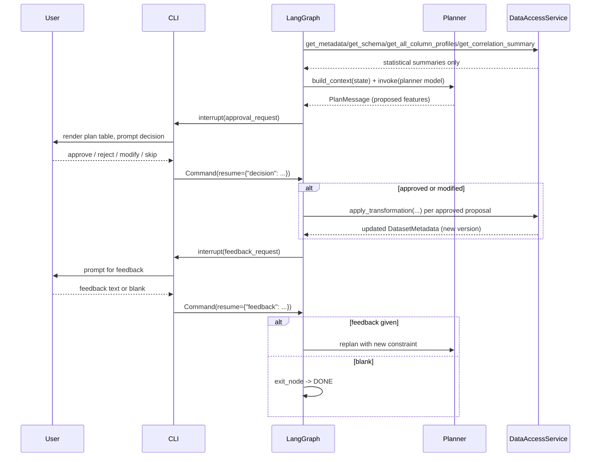

# Architecture

## Component diagram

## Graph structure

## Approval sequence

## Data-privacy enforcement points

1. `PandasDataAccessService._build_schema` classifies every column via
   `PIIAggregator` at construction and after every transformation; PII/blocked
   columns are flagged in `ColumnSchema.is_pii` / `is_blocked`.
2. `DataAccessService._assert_visible` (called by `get_column_profile`,
   `get_correlation_summary`, `request_preview`) raises `PolicyViolationError`
   for any blocked/PII column — this is enforced in code, not by prompting the
   LLM to "be careful."
3. `ContextBuilder.build` only ever reads from `HarnessState`, which itself
   only ever receives `DatasetMetadata`/`ColumnProfile`/`CorrelationSummary`/
   `PreviewResult` objects — there is no code path by which a raw DataFrame
   can enter the state that feeds the LLM prompt.
